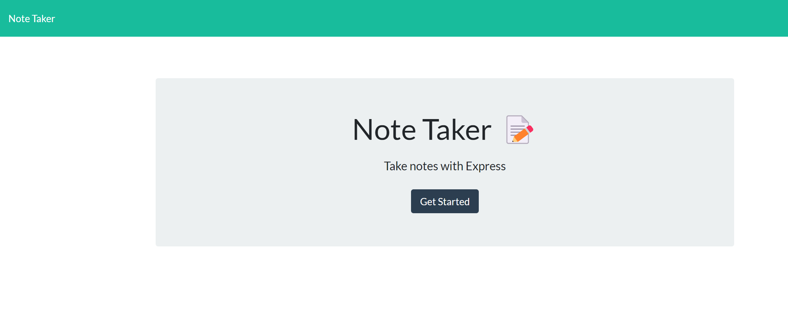
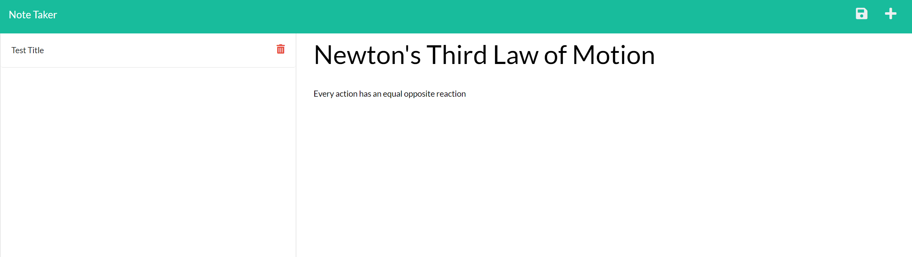
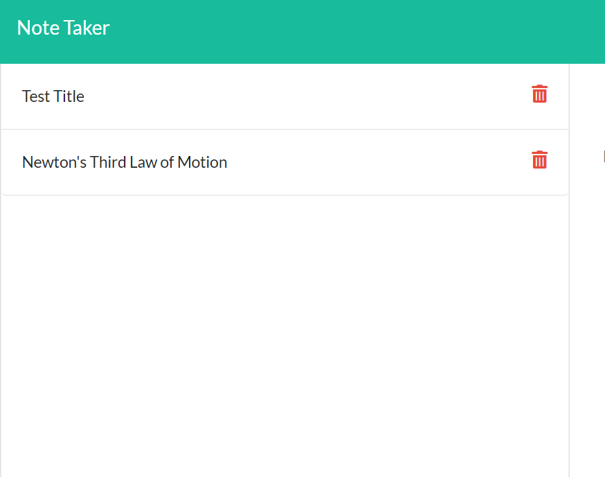

<!-- @format -->

# Note Taker

This project is covered by the MIT license.
https://opensource.org/licenses/MIT;

## Description

This project allows you to take and organize notes. Each note has a title and text, and will persist as you come and go from the page. You can also delete notes at any time.

## Table of Contents

- [Description](#description)
- [Installation](#installation)
- [Usage](#usage)
- [License](#license)
- [Contributing](#contributing)
- [Tests](#tests)
- [Questions](#questions)

## Installation

Install the packages using "npm i" then run the server using node or nodemon. Follow the instructions to the correct port.

## Usage

On opening you will be directed to a welcome page.

Clicking the start button will bring you to the main page. Add a note by clicking the plus in the top right corner, the save button will be found here.

You can access any note by clicking on it at the left menu. A delete button is also found here.

## License

This project is covered by the MIT license.
https://opensource.org/licenses/MIT;

## Contributing

I used the starter code miniature-eureka from Xandromus's respository.

## Tests

N/A

## Questions

Contact [prkrgreenwell](https://github.com/prkrgreenwell) on GitHub with any questions you may have
